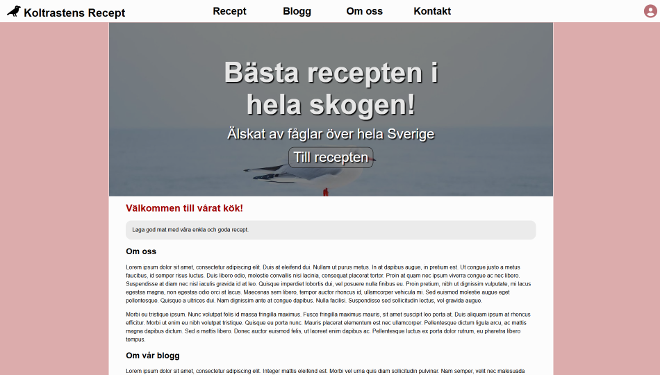
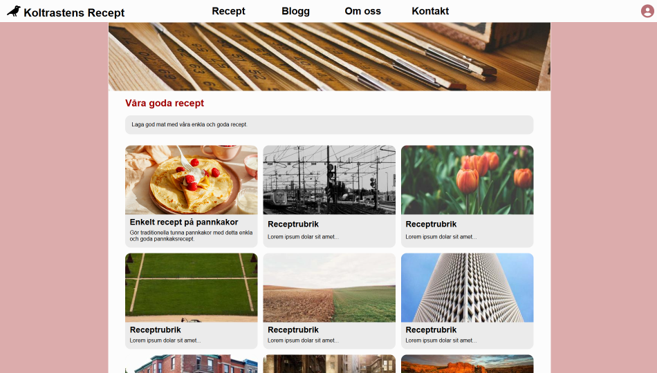

# 🐦‍⬛ Koltrastens Recept | Frontend education project

The first project I worked on during the Frontend education at Lexicon.

It is a website for food recipes called **Koltrastens Recept** (swedish for **"The Blackbird's Recipies"**) where the user can browse for recipies and view ingredients and instructions for a recipe of their chosing.

It's build using only HTML and CSS and therefore has no functioning interactivity in for example the contact form. The website also uses [Lorem Picsum](https://picsum.photos/) for random placeholder images.

> [!NOTE]
> The website is entirely in Swedish, as well as most code comments and Git Commit messages.

---



---


## 🚀 Features

- 🔎View and chose from a grid-list of recipies (all but one recipe is a placeholder).
- 🧑‍🍳See ingredients and cooking instructions for a simple pancake recipe.
- 📞A contact form to contact "The Blackbird's Recipies" (non-functional).
- 📱A (mostly) responsive design.


## ⚙️ Technologies

|  Technology   |     Used for      |
| ------------- | ----------------- |
| HTML          | Markup            |
| CSS           | Styling           |
| Git           | Version controll  |
| GitHub        | Remote repository |


## 📦 Installation

1. Clone the repository or download the ZIP-file from GitHub.
```bash
git clone https://github.com/wilkin-2005/Receptovning.git
```

2. Open the file  [`home-page.html`](./home-page.html) with the Visual Studio Code extension [Live Server](https://marketplace.visualstudio.com/items?itemName=ritwickdey.LiveServer) by Ritwick Dey.  

3. The website should automatically open in your browser.


## 🪳 Known Issues

- The responsivness on the header isn't great and starts overflowning at a viewport width of just 678px or less.
- If you try to submit the contact form the website will crash.


## 👥 Author

### Wilmer Kindstedt
- GitHub: [@wilkin-2005](https://github.com/wilkin-2005)
- LinkedIn: [Wilmer Kindstedt](https://www.linkedin.com/in/wilmer-kindstedt-7b6a99407/?skipRedirect=true)


## 🙏 Credits / Acknowledgements

- Crow and User icons from [Font Awesome](https://fontawesome.com/)
- Placeholder images from [Lorem Picsum](https://picsum.photos/)
- Lorem Ipsum paragraphs from [Lipsum Generator](https://www.lipsum.com/)
- Pancake recipe from my [teachers at Lexicon](https://www.figma.com/design/jN5rbXkvzz9K1q20Kj0wtL/Pannkakor?node-id=0-1&p=f)
- Design inspiration from [Recept.se](https://recept.se/) and [Köket.se](https://www.koket.se/)
- Help with CSS lenght units from [whatunit.com](https://whatunit.com/)

---


